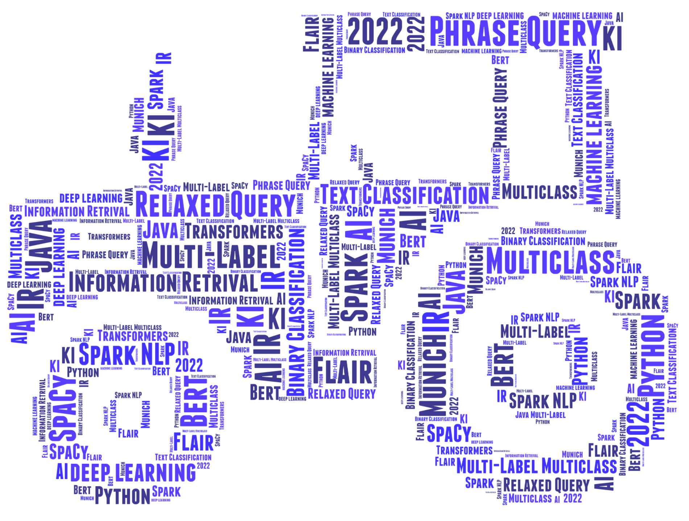

# PhraseTractor

*Using Information Retrieval to label text for machine learning*

PhraseTractor is a Java based command line tool that implements Information Retrieval queries, such as:

-	phrase query,
-	relaxed query, or
-	regular expression

to label text data for machine learning algorithms. Please read the documentation about [building this tool](./HowToBuild.md)
and [using the executable](./docs/PhraseTractor.pdf) to understand the application in all details.

Image generated by [wordartprints.com](https://wordartprints.com/)
